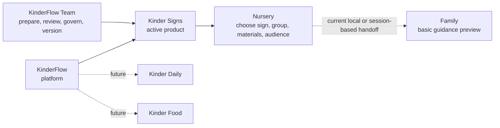

# KinderFlow digital growth capstone

KinderFlow turns reviewed nursery content into reusable family guidance so educators can support school-home continuity without repeatedly creating and sending the same material.

KinderFlow is the early-childhood digital platform. Kinder Signs is its first active AI-enabled product. Kinder Daily and Kinder Food are future products, not current capabilities.

## Current status

**Recommendation: PROCEED WITH CONDITIONS.** The frozen repository contains enough technical and product evidence to fund pilot readiness and a controlled Kinder Signs service test. It does not contain the rights, qualified content approval, production controls, or commercial evidence required for an unconditional live pilot or full launch.

The current product is a connected local prototype:

- the KinderFlow Team can process an adult reference, inspect movement evidence, prepare deterministic visual candidates, and create family materials;
- a nursery can simulate choosing a sign, group, material set, and audience;
- a family-facing guidance prototype exists; and
- a personalised assignment-driven family library remains a next product iteration.

No current sign is production-published or available through a real school or family account.

## Key evidence

| Evidence | What is supported | Decisive limitation |
|---|---|---|
| MediaPipe Computer Vision | Versioned WATER evidence has 332 frames, 100% pose coverage, 93.98% dominant-hand coverage, 20 missing hand frames, 1 interpolated frame, and 19 unresolved frames. | Capture coverage is not sign recognition or linguistic correctness. |
| Connected local MVP | Upload, bounded direct MP4 URL, demo reference, review, pose selection, visual choice, family-material creation, nursery assignment, and basic family preview are connected locally. | State is local or session-based. There is no real identity, delivery, or durable multi-user persistence. |
| Visual system | Six sign packages contain 18 deterministic Open Peeps-derived SVG options. The registry records the official source and founder-verified CC0 basis. | Every current option is a draft requiring qualified sign and visual review. Open Peeps defines style, not sign mechanics. |
| Gemini FX | Separate local illustrative previews exist for MORE, HELP, and MILK. | They are not current-run or landmark-generated output. Rights, fidelity, and transparency gates remain open. |
| Workflow evidence | A valid, inactive 12-node n8n export and a local LangSmith `DRY_RUN` summary exist. | No target-runtime n8n execution, live LangSmith trace, or live final LLM call is claimed. |
| Automated checks | The standard local suites contain 184 tests: 183 pass and 1 environment-dependent test is skipped. | The explicit MediaPipe integration rerun failed in headless macOS graphics-context creation and is not claimed as fresh success. |
| Tableau | A packaged Round 1 workbook, static image, source data, four worksheets, and one dashboard are versioned. | It is a market-decision artifact, not a production or pilot dashboard. |

Detailed claim wording and evidence paths are controlled in the [final claims matrix](docs/final_claims_matrix.md).

## Quick start

The local environment evidenced during reconciliation uses Python 3.9.6 and MediaPipe 0.10.14 with the legacy Solutions API. Python 3.11 or 3.12 remains the target for a clean rebuilt environment; the host's default Python 3.13 environment is not equivalent.

From the repository root:

```bash
poc_env/bin/python mvp/app.py
```

Then open:

- [Create a Sign](http://127.0.0.1:8000/create-sign.html)
- [KinderFlow overview](http://127.0.0.1:8000/index.html)
- [Master Content Studio](http://127.0.0.1:8000/content-studio.html)
- [Flashcard Studio](http://127.0.0.1:8000/flashcards.html)
- [School Admin](http://127.0.0.1:8000/school.html)
- [Family Preview](http://127.0.0.1:8000/family.html)

Use only reference media that is authorized for the intended processing and display. The direct video URL path accepts a bounded direct public MP4; it is not a general video-platform scraper or a production security boundary.

Run the standard local suites:

```bash
poc_env/bin/python -m unittest discover -s content_ops/tests -q
poc_env/bin/python -m unittest discover -s mvp/tests -q
poc_env/bin/python -m unittest discover -s poc/tests -q
poc_env/bin/python -m unittest discover -s prototype/tests -q
poc_env/bin/python -m unittest discover -s tools/tests -q
```

See the [MVP README](mvp/README.md) for environment details and controlled error behaviour.

## What the POC proves

The POC answers a bounded question: can an adult sign-reference video become structured, body-relative, human-inspectable movement evidence?

The versioned WATER run supports:

- frame-level pose and hand extraction;
- raw and normalized landmark outputs;
- explicit missing-frame, interpolation, and unresolved-gap accounting;
- trajectory and displacement diagnostics;
- a technical result of `EXTRACTION_PASS`; and
- a movement-representation result of `MOTION_REPRESENTATION_PARTIAL`.

It does not prove sign correctness, linguistic interpretation, generalisation across signs or people, professional approval, production performance, or commercial value. The full method, charts, lineage, and reproduction boundary are in the [POC documentation](poc/poc_documentation.md).

## What the MVP proves

The local MVP connects evidence to a product workflow:

```text
adult reference
-> MediaPipe and OpenCV evidence
-> reference review
-> tracked poses, selected frames, or reviewed-reference fallback
-> deterministic visual candidates
-> human approval boundary
-> Flashcard, Routine Card, or Story
-> local nursery assignment
-> basic family guidance preview
```

The current Create a Sign interface has five steps: Sign & reference, Review reference, Choose poses, Approve visual, and Family materials. The dominant-hand tracked-pose rule requires at least 90% coverage. Lower coverage routes the user to selected frames or a reviewed-reference fallback with a recorded rationale.

Flashcard and Routine Card outputs are deterministic Bilingual or Spanish browser layouts. Print or Save as PDF is available through the browser; no PNG export or server-generated PDF is claimed. Story is a deterministic local MORE example. Song is Coming soon.

School Admin uses three synthetic groups and six fictional children, supports group or child selection, and prevents duplicate local assignment. Family Preview reads browser state. This demonstrates the intended handoff, not a production assignment-to-family service.

See the [MVP documentation](mvp/mvp_documentation.md), [prototype guide](prototype/README.md), and [reality check](docs/mvp_reality_check.md).

## Business and pilot decision

Little Steps Nursery is the pseudonymised operating archetype and Cleo is its owner/director and economic-buyer persona. The commercial model is school-led B2B/B2B2C with a per-centre annual subscription. Families and children are users and beneficiaries, not the primary payer.

The proposed validation programme is:

- 8-9 weeks total;
- about 3-4 weeks of controlled service testing inside that period;
- 2-3 nursery centres;
- 3-5 reviewed signs; and
- EUR 5.5k-EUR 17.3k for readiness plus controlled testing.

The existing prototype is sunk work. A production build and recurring operations sit outside that range and remain TBD.

| Scenario | Annual price per centre | 12-month ROI | 36-month ROI | Modelled break-even |
|---|---:|---:|---:|---:|
| Low | EUR 600 | -84.3% | -60.9% | More than 36 months |
| Base | EUR 1,200 | -66.7% | 22.3% | Month 29.3 |
| High | EUR 1,800 | -44.3% | 116.1% | Month 17.2 |

These are calculated decision scenarios, not forecasts or willingness-to-pay evidence. Core add-on revenue is EUR 0. The Little Steps price lens represents about 0.25%-0.92% of the selected EUR 195k-EUR 238k central-to-upper tuition planning envelope, depending on price and fee assumption. The 85% occupancy case is a lower sensitivity outside those selected endpoints.

Proceed only if rights and privacy gates close, reviewers can approve content efficiently, educators repeat assignments, families observe value, and paid continuation is credible. Use the [strategic plan](strategic_plan.md), [ROI and risk assessment](roi_risk_assessment.md), [cost and timeline](cost_timeline/estimate.md), and [pilot measurement plan](docs/kinder_signs_pilot_measurement.md) for the decision rules.

## Architecture



Kinder Signs, Kinder Daily, and Kinder Food sit at the same platform level; only Kinder Signs is active. The dotted nursery-to-family line marks the current prototype boundary. Real family delivery, assignment filtering across authenticated accounts, and persistent personalised libraries remain future work.

Inside Kinder Signs, Computer Vision produces technical evidence; deterministic rules and people control content readiness. The school does not operate MediaPipe, LLM, n8n, or LangSmith workflows.

## Repository map

```text
assets/          Source and asset registries, visual provenance, review records
build/           Versioned draft publication packages
compliance/      Preliminary EU AI Act and GDPR assessments
content_ops/     States, provenance, contracts, gates, audit events, regression set
cost_timeline/   Validation investment and staging
dashboard/       Round 1 Tableau artifact and documentation
data/            Tableau source data and source register
docs/            Evidence controls, architecture, audits, business, pilot, reality checks
feedback/        Historical Round 1 feedback and KEEP decision
mvp/             Local Python service and content-package logic
poc/             Versioned Computer Vision source, outputs, diagnostics, and tests
presentation/    Existing deck plus documentation-only final handoff
prototype/       Local role-based HTML, CSS, and JavaScript interfaces
research/        Historical sector, opportunity, and use-case research
workflow/        n8n export, deterministic gate, and LangSmith dry-run
```

## Documentation

Start with:

- [Final deliverables audit](docs/final_deliverables_audit.md)
- [Final claims matrix](docs/final_claims_matrix.md)
- [Capstone requirement matrix](docs/capstone_requirement_matrix.md)
- [Submission checklist](docs/submission_checklist.md)

Product and technical evidence:

- [Use case definition](use_case_definition.md)
- [POC documentation](poc/poc_documentation.md)
- [MVP documentation](mvp/mvp_documentation.md)
- [System one-page summary](docs/kinder_signs_system_one_page.md)
- [Technology and course methods](docs/course_technologies_applied.md)
- [Dashboard documentation](dashboard/dashboard_documentation.md)
- [n8n workflow documentation](workflow/kinder_signs_n8n_workflow.md)

Business and decision evidence:

- [Little Steps operating case and KPIs](docs/little_steps_operating_case_kpis.md)
- [ROI and risk assessment](roi_risk_assessment.md)
- [Cost and timeline](cost_timeline/estimate.md)
- [Strategic plan](strategic_plan.md)
- [Pilot measurement plan](docs/kinder_signs_pilot_measurement.md)

Governance and delivery:

- [EU AI Act assessment](compliance/eu_ai_act_compliance.md)
- [GDPR documentation](compliance/gdpr_documentation.md)
- [Responsible AI audit](docs/audits/responsible_ai_audit.md)
- [Green AI audit](docs/audits/green_ai_audit.md)
- [Presentation handoff](presentation/documentation_handoff.md)
- [Demo script and backup plan](presentation/demo_script.md)

## Known limitations

- No personalised assignment-driven family mini-library, real family account, notification, delivery integration, or durable cross-session state exists.
- No production authentication, role-based access control, tenant isolation, rate limiting, egress control, decoder isolation, monitoring, backup, deletion service, or deployment is claimed.
- The six-sign asset registry and older five-sign content-operation package are not fully reconciled.
- All 18 static visual candidates need qualified hand, sign, visual, accessibility, and publication review.
- Reference, contextual, and Gemini rights are not fully cleared for every intended external, print, or commercial use.
- Gemini files are separate demonstration media, not current pipeline output.
- n8n target-runtime execution, a live LangSmith trace, and a live final LLM call are unclaimed.
- Browser Print or Save as PDF exists, but final saved-PDF visual QA with approved assets is pending.
- The explicit headless integration rerun failed because a macOS graphics context could not initialize.
- No real pilot data, paid customer, recurring revenue, product-market fit, compliance certification, or production deployment is claimed.

The final presentation still requires a manual PowerPoint update and visual inspection, plus a tested backup recording. Those actions are tracked in the [submission checklist](docs/submission_checklist.md).
